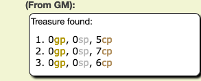
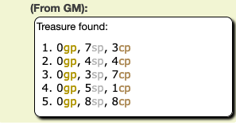
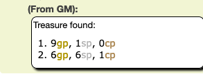

# Coinage Generator

This is a random coin generator for Roll20.net that lets you specify a ballpark value and a number of NPCs to generate treasure for.

Its intended use is the scenario in which the party loots bodies of random NPCs who are unlikely to have much of value other than coins (e.g. a bunch of goblins). About every tenth time, the command will also add a non-coinage item to the list, with its value proportional to the coinage value -- an NPC will not have 2cp and a potion of healing, but an NPC may have 120gp and a potion of healing.

Usage: <code>!treasure [hoardSize] [count]</code>

Both parameters are optional and will default to the value 1.

The <em>hoardSize</em> parameter controls the band of integer values from which a random number will be selected. It is an exponent of 10. So, a value of 1 sets the maximum value in copper pieces to 10, and random coinage values are selected from within the range up to 10. A value of 2 sets the maximum value in copper pieces to 100 (102) and thus sets teh band of values to between 10 and 100. And so on. The more likely the NPCs are to have a lot of coins, the higher <em>hoardSize</em> should be.

The <em>count</em> parameter specifies the number of NPCs for whom treasure should be generated.

The command causes a message to be whispered to the GM giving coinage values broken down into gold, silver, and copper pieces. So if your party surprises you and murders everybody in the tavern and loots the bodies, you can quickly run the command, specifying the hoard size (based perhaps on how fancy the tavern is) and the body count, saving yourself the need to roll a bunch of dice or come up with the amounts on the fly.

## Examples

<code>!treasure 1 3</code>

<code>!treasure 2 5</code>

<code>!treasure 3 2</code>

