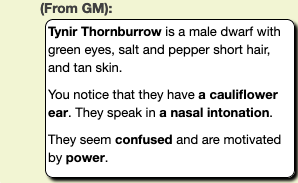
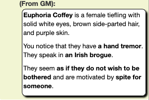

# NPC Generator

This is a random NPC generator for Roll20.net that lets you whip up an NPC on the fly, specifying (optionally) race and gender. The script does the rest, whispering to the GM a plausible name for the race and gender, some physical characteristics, a feature or quirk, and a motivation. 

The script does not do any checking for compatibility among the various details it assembles, so for example you might get an NPC who seems good-natured but wears a scowl. As GM, you can adapt as needed.

Usage: <code>!npc [race] [gender]</code>

Both parameters are optional and will cause random selections if not specified.

The <em>race</em> parameter at present includes `human`, `dwarf`, `tiefling`, and `halfling` but would be easy to expand (and will likely be expanded later). Names in the list the script uses came either out of my head or from the [Fantasy Name Generators](https://www.fantasynamegenerators.com/) site. 

The <em>gender</em> parameter can be one of `male`, `female`, or `nonbinary`. It causes the script to use a name more closely matching the common forms for the given genders, though names are arbitrary and gender fluid, so I realize that this is imperfect.

If you specify invalid parameter values, you'll get something pretty random.

## Examples

<code>!npc dwarf male</code>

<code>!npc tiefling</code>

<code>!npc</code>

